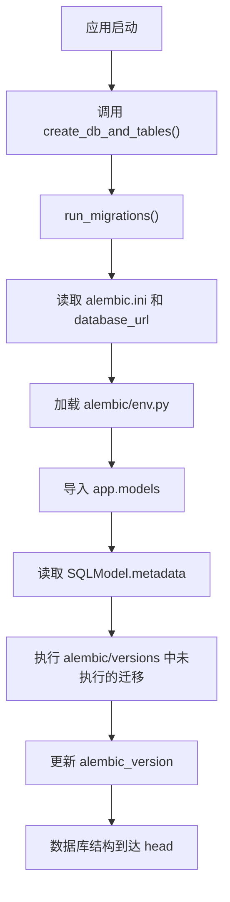

# 技术名称：Alembic

## 1. 这是什么？

Alembic 是 SQLAlchemy 生态里的数据库迁移工具。

它的核心作用是：把数据库表结构的变化记录成一份份可执行、可回滚、可追踪的 migration 文件。这样项目里的模型代码变了，旧数据库也能通过明确的迁移步骤同步到新结构。

在 `anythingllm-mini` 里，它主要负责管理 SQLite 表结构，比如这次给 `conversation_messages` 表新增 `metrics` 列。

## 2. 我在项目中为什么引入它？

这次项目遇到的具体问题是：旧的本地数据库里已经有 `conversation_messages` 表，但没有 `metrics` 列；代码层面已经引入了 `ConversationMessage.metrics`，Workspace chat 也会读写这个字段。

如果不用 Alembic，会有几个缺点：

- `SQLModel.metadata.create_all()` 只能创建不存在的表，不能可靠地修改已有表结构。
- 手写临时补列逻辑容易散落在启动代码里，后续字段越多越难维护。
- 不同环境里的数据库可能处于不同状态，但项目没有统一版本记录。
- 新同学或未来的自己很难知道数据库结构是怎么从 V3 演进到 V3.5 的。

引入 Alembic 后解决了这些问题：

- 数据库结构变化被固化在 `alembic/versions/` 下。
- 当前数据库版本记录在 `alembic_version` 表里。
- 新库可以直接 `upgrade head` 建到最新结构。
- 旧库可以先 `stamp` 到已有结构版本，再 `upgrade` 到最新版本。
- 启动初始化逻辑可以统一调用 Alembic，而不是继续维护手写补丁。

## 3. 它在项目中的位置

Alembic 属于基础设施层，更准确地说是数据库 schema 管理层。

上游是谁：

- SQLModel ORM 模型，例如 `app/models/conversation.py`
- 数据库配置，例如 `app/core/config.py` 里的 `database_url`
- 数据库 engine 创建逻辑，例如 `app/db/session.py`

下游是谁：

- SQLite 数据库文件，当前默认是 `anythingllm_mini.db`
- 应用启动初始化逻辑，当前在 `app/db/init_db.py`
- 测试数据库初始化流程，例如 `tests/test_db_init.py`

它和这些模块交互：

- `alembic.ini`：Alembic 的主配置文件。
- `alembic/env.py`：迁移运行环境，读取项目配置，加载 `SQLModel.metadata`。
- `alembic/versions/*.py`：具体迁移脚本。
- `app/db/init_db.py`：提供 `run_migrations()` 和 `create_db_and_tables()`，应用启动时执行 `upgrade head`。
- `app/models/__init__.py`：被 `env.py` 导入，用来确保模型注册进 `SQLModel.metadata`。

## 4. 具体使用流程

当前项目的运行流程：



当前项目已经存在三份迁移：

1. `0001_baseline_v3_schema`
   - 表示 V3 时期已有的基础表结构。
   - 包括 `workspaces`、`conversations`、`workspace_documents`、`conversation_messages`。
   - 这个版本里还没有 `conversation_messages.metrics`。

2. `0002_add_message_metrics`
   - 在 `conversation_messages` 表上新增 `metrics` JSON 列。
   - 默认值是 `{}`。
   - 对应 V3.5 中 Workspace chat metrics 的持久化需求。

3. `0003_add_agent_invocations_and_steps`
   - 新增 `agent_invocations` 和 `agent_steps` 表。
   - 对应 post-V4 Agent invocation / step 独立持久化需求。

处理旧库的流程：

```bash
conda run -n anythingllm-mini alembic stamp 0001_baseline_v3_schema
conda run -n anythingllm-mini alembic upgrade head
```

含义是：

- `stamp`：告诉 Alembic 当前旧库已经具备 `0001` 所描述的表结构，但不要实际重建这些表。
- `upgrade head`：从 `0001` 继续执行后续迁移，也就是补上 `metrics` 列。

以后新增字段时的推荐流程：

```bash
conda run -n anythingllm-mini alembic revision --autogenerate -m "add xxx"
conda run -n anythingllm-mini alembic upgrade head
conda run -n anythingllm-mini pytest -q
```

注意：`--autogenerate` 生成后必须人工检查 migration 文件，不能盲目信任自动生成结果。

## 5. 核心概念

- migration：一次数据库结构变更。
- revision：迁移版本 ID，例如 `0002_add_message_metrics`。
- head：当前迁移链的最新版本。
- base：迁移链的起点。
- upgrade：把数据库从旧版本升级到新版本。
- downgrade：把数据库从新版本回退到旧版本。
- stamp：只记录数据库当前版本，不实际执行表结构变更。
- `alembic_version`：Alembic 在数据库里维护的版本表。
- `target_metadata`：Alembic 用来对比 ORM 模型和数据库结构的元数据。
- autogenerate：根据模型和数据库差异自动生成迁移脚本草稿。
- batch mode：SQLite 修改表结构能力有限，Alembic 用 batch 方式兼容部分变更。

## 6. 关键配置 / 参数

| 配置 / 参数 | 当前值 / 位置 | 作用 | 调整影响 |
| --- | --- | --- | --- |
| `sqlalchemy.url` | `alembic.ini` 中默认 `sqlite:///./anythingllm_mini.db` | Alembic CLI 默认连接的数据库 | 改错会迁移到错误数据库 |
| `settings.database_url` | `app/core/config.py`，默认 `sqlite:///./anythingllm_mini.db` | 应用运行时数据库地址 | 影响应用启动、测试和迁移目标 |
| `script_location` | `alembic` | 指向迁移脚本目录 | 改错后 Alembic 找不到 `env.py` 和 versions |
| `target_metadata` | `alembic/env.py` 中的 `SQLModel.metadata` | autogenerate 对比模型结构的依据 | 模型没有注册时会漏生成迁移 |
| `compare_type=True` | `alembic/env.py` | 让 Alembic 检查列类型变化 | 可能生成更多类型变更，需要人工确认 |
| `render_as_batch=True` | `alembic/env.py` | 更好兼容 SQLite 表结构修改 | 对 SQLite 友好，但 migration 生成结果要检查 |
| `disable_existing_loggers=False` | `alembic/env.py` | 避免 Alembic logging 配置关闭应用 logger | 如果去掉，可能影响日志测试和运行期日志 |

## 7. 替代技术对比

| 技术 | 适合场景 | 当前项目为什么没选 |
| --- | --- | --- |
| `SQLModel.metadata.create_all()` | 项目早期，只创建全新表 | 不能可靠修改旧表，无法解决旧库缺 `metrics` 的问题 |
| 手写 SQL 补丁 | 一次性、小脚本、临时修复 | 容易分散在启动逻辑里，缺少版本记录，不适合持续演进 |
| Alembic | SQLAlchemy / SQLModel 项目的正式迁移管理 | 和当前技术栈最贴合，轻量，适合学习项目逐步演进 |
| Django migrations | Django 项目 | 当前项目是 FastAPI + SQLModel，不使用 Django ORM |
| Flask-Migrate | Flask + SQLAlchemy 项目 | 底层也是 Alembic，但当前项目不是 Flask |
| Flyway / Liquibase | 多语言、大型团队、偏 SQL-first 管理 | 对当前 Python 学习项目偏重，集成成本更高 |

当前项目选择 Alembic，是因为 `anythingllm-mini` 已经使用 SQLModel / SQLAlchemy，Alembic 是这个生态中最自然的 schema migration 工具。

## 8. 优点和缺点

优点：

- 迁移历史清晰，数据库结构变化可追踪。
- 支持升级和回滚。
- 和 SQLAlchemy / SQLModel 集成自然。
- 可以配合 autogenerate 提高开发效率。
- 适合从学习项目过渡到更真实的后端工程结构。

缺点：

- 引入了额外概念：revision、head、stamp、upgrade、downgrade。
- 自动生成的迁移不一定完全正确，必须人工 review。
- SQLite 对部分 ALTER TABLE 能力有限，复杂变更可能需要 batch 或手写迁移。
- 旧库第一次接入 Alembic 时需要小心 baseline，否则可能重复建表或迁移失败。
- 应用启动时自动 `upgrade head` 简单方便，但大型生产系统通常会把迁移放到独立部署步骤里。

## 9. 遇到的问题与解决方案

问题 1：旧库没有 `metrics` 列。

- 现象：代码已经需要读写 `ConversationMessage.metrics`，但旧的 `conversation_messages` 表没有这个字段。
- 原因：之前项目没有正式 migration 体系，`create_all()` 不会修改已有表。
- 解决：新增 `0001_baseline_v3_schema` 表示旧库已有结构，再新增 `0002_add_message_metrics` 补列；旧库执行 `stamp 0001` 后再 `upgrade head`，会继续升级到包含 Agent invocation / step 表的最新版本。

问题 2：不能把已有旧表重新 create 一遍。

- 现象：如果直接对旧库执行 baseline 的 `upgrade()`，会尝试创建已经存在的表。
- 原因：baseline migration 是给新库从零建表用的；旧库已经有这些表。
- 解决：旧库使用 `alembic stamp 0001_baseline_v3_schema`，只登记版本，不执行建表。

问题 3：Alembic logging 配置可能影响应用日志测试。

- 现象：日志相关测试可能捕捉不到服务层 logger 输出。
- 原因：Alembic 默认 `fileConfig()` 有机会禁用已存在 logger。
- 解决：在 `alembic/env.py` 中使用 `fileConfig(config.config_file_name, disable_existing_loggers=False)`。

问题 4：SQLite 相对路径需要统一解析。

- 现象：测试和 CLI 在不同工作目录运行时，SQLite 相对路径可能指向不同位置。
- 原因：`sqlite:///./anythingllm_mini.db` 是相对路径。
- 解决：`app/db/init_db.py` 和 `app/db/session.py` 复用项目里的 `_resolve_database_url()`，让路径解析保持一致。

## 10. 面试常见问题

问题：Alembic 解决的是什么问题？

回答：它解决数据库 schema 随代码演进的问题。ORM 模型变了以后，Alembic 用 migration 文件把旧数据库升级到新结构，并记录当前数据库处于哪个版本。

问题：为什么不用 `create_all()`？

回答：`create_all()` 适合创建不存在的表，但不适合修改已有表。比如旧表缺一列时，它不会自动安全补列，也没有版本记录。

问题：`stamp` 和 `upgrade` 有什么区别？

回答：`stamp` 只修改 Alembic 的版本记录，不执行表结构变更；`upgrade` 会真正执行 migration。旧库接入 baseline 时常用 `stamp`。

问题：`--autogenerate` 可靠吗？

回答：它是生成 migration 草稿的工具，不是最终答案。它能发现很多模型和数据库差异，但生成结果必须人工检查，尤其是数据迁移、字段重命名、SQLite 限制这类场景。

问题：生产环境是否应该在应用启动时自动迁移？

回答：小型项目和学习项目可以这样简化流程；生产环境通常更推荐把 Alembic migration 放在独立部署步骤中，先迁移数据库，再启动新版本应用。

## 11. 后续优化方向

- 增加 `notes` 或 README 中的标准迁移命令说明。
- 为每次 schema 改动建立规则：先改模型，再生成 migration，再 review migration，再跑测试。
- 增加 CI 检查，确保 migration 文件可执行，数据库能从空库升级到 head。
- 在 tests 中覆盖更多迁移路径，例如从旧版本升级到最新版本后的数据兼容性。
- 如果未来引入 PostgreSQL，把 SQLite 特有行为和 PostgreSQL 行为分别测试。
- 生产化时考虑不在应用启动中自动迁移，而是在部署脚本或独立命令中执行 `alembic upgrade head`。
