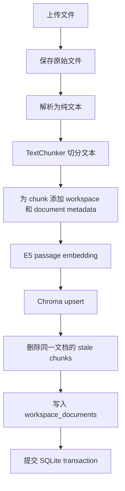
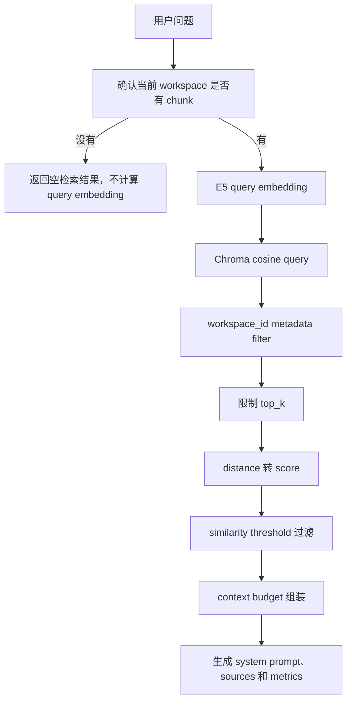

# 技术名称：Chroma 与 RAG 检索

## 1. 这是什么？

RAG（Retrieval-Augmented Generation，检索增强生成）把“从文档中找相关内容”和“让
LLM 生成回答”拆成两个步骤：

1. 先把文档切成 chunk，并转换成 embedding 向量。
2. 用户提问时，把问题也转换成向量，从向量库中找出语义最相关的 chunk。
3. 只把满足 workspace、相似度和上下文预算约束的 chunk 交给 LLM。

`anythingllm-mini` 当前使用：

- `sentence-transformers` 生成 embedding。
- `intfloat/multilingual-e5-small` 作为默认 embedding 模型。
- Chroma 持久化 chunk、向量和检索元数据。
- `RAGService` 组织索引、检索和上下文组装。

这篇文档属于 **RAG quality** 能力线，主要影响历史 V2 RAG 和 V3 workspace 隔离。

## 2. 为什么项目需要它？

普通 LLM 只知道模型训练时学到的内容，不会自动读取用户上传到本地 workspace 的文件。
如果把整份文档直接塞进 prompt，又会遇到几个问题：

- 文档可能很长，超过模型上下文窗口或占用过多输入预算。
- 每次提问都传整份文档，相关内容少、噪声多。
- 多个 workspace 的文档必须隔离，不能互相检索。
- 文档更新或删除后，旧 chunk 不能继续留在向量库里。
- API 展示的 sources 必须和真正进入 prompt 的内容一致。

当前实现通过“切块、embedding、workspace filter、相似度阈值、context budget”形成一个
最小但可解释的 RAG 流程。它不是完整的知识库平台，也没有 reranking、混合检索或自动评估。

## 3. 它在项目中的位置

核心模块：

| 模块 | 当前职责 |
| --- | --- |
| `backend/app/core/rag.py` | 定义 `DocumentChunk`、`RetrievedChunk` 和字符级 `TextChunker` |
| `backend/app/core/embeddings.py` | 封装 E5 embedding、模型懒加载和同步推理线程切换 |
| `backend/app/core/vectorstore.py` | 封装 Chroma 持久化、upsert、workspace 查询、重建和删除 |
| `backend/app/services/rag_service.py` | 编排索引、检索、context budget 和 source 转换 |
| `backend/app/services/workspace_document_service.py` | 把上传、解析、索引和数据库登记串成文档生命周期 |
| `backend/app/services/workspace_service.py` | Workspace chat 主动检索并把 context 交给 LLM |
| `backend/app/tools/document_tools.py` | 给 V4 Agent 提供显式 `workspace_document_search` 工具 |

数据分别保存到三个位置：

| 数据 | 保存位置 | 作用 |
| --- | --- | --- |
| 原始文件 | `storage/uploads/` | 保留上传文件 |
| 解析文本 | `storage/parsed/` | 作为 chunking 输入 |
| chunk、向量、metadata | `storage/chroma/` | 支持语义检索 |
| 文档登记信息 | SQLite `workspace_documents` | 保存 workspace 归属、路径和 chunk 数量 |

Chroma 是检索状态，不是文档业务记录的唯一真相；SQLite、文件系统和 Chroma 仍是三个独立
存储边界。

## 4. 文档索引流程

当前 workspace 文档上传流程：



### 4.1 Chunking

`TextChunker` 当前是字符级切分：

- 默认 `chunk_size=400`。
- 默认 `chunk_overlap=60`。
- 优先在 chunk 后半段出现的段落边界 `\n\n` 处切分。
- 找不到合适段落边界时，按字符硬切。
- 下一个 chunk 从 `end - chunk_overlap` 开始。
- 空文本、非正数 chunk size、负 overlap、`overlap >= chunk_size` 都会失败。

chunk ID 是确定性的：

```text
{document_id}:{chunk_index}
```

每个 chunk 同时携带：

- `document_id`
- `workspace_id`
- `display_filename`
- `extension`
- `chunk_index`
- `character_count`

确定性 ID 让同一文档重新索引时可以覆盖已有 chunk，并识别新版本中已经消失的 stale chunk。

### 4.2 Embedding

默认模型是 `intfloat/multilingual-e5-small`。E5 对 query 和 passage 使用不同前缀：

```text
文档 chunk: passage: <chunk text>
用户问题:   query: <question>
```

当前 wrapper 还做了三件事：

- `normalize_embeddings=True`，让向量适合 cosine distance 比较。
- 模型第一次使用时才加载，后续复用同一实例。
- `model.encode()` 是同步计算，通过 `asyncio.to_thread()` 移出 async event loop。

模型懒加载使用线程锁，避免并发请求第一次触发时创建多个模型实例。

### 4.3 Chroma upsert 和重建

`ChromaVectorStore` 每批最多 upsert 100 个 chunk。一次调用中的 chunk 必须：

- 非空。
- embedding 数量和 chunk 数量一致。
- embedding 向量非空。
- 全部属于同一个 document。
- 全部属于同一个 workspace。

重建同一文档时，store 会先读取旧 chunk IDs，完成新 chunk upsert 后，再删除：

```text
stale_ids = existing_ids - new_ids
```

如果任一批 upsert 或 stale chunk 删除失败，当前策略会尽力删除这个
`(workspace_id, document_id)` 下的全部 chunk。这个取舍优先避免“新旧 chunk 混杂”或“只写入
半批”的索引状态，但代价是失败后旧索引也不会保留，需要重新索引文档。

## 5. 检索流程

Workspace chat 的检索流程：



### 5.1 Workspace scope

当前使用一个共享 Chroma collection，workspace 隔离通过 metadata filter 实现：

```python
where={"workspace_id": workspace_id}
```

查询、计数和删除都要求明确的 `workspace_id`。删除文档时使用
`document_id + workspace_id` 组合条件，避免同名 ID 或错误调用影响其他 workspace。

这是应用层隔离，不是独立 collection 或数据库级多租户权限。当前项目也没有用户鉴权，因此
不能把它描述成生产级 tenant security。

### 5.2 Top K 和 similarity threshold

Chroma 返回 distance，当前项目转换成：

```text
score = 1.0 - distance
```

随后只保留：

```text
score >= similarity_threshold
```

默认配置：

- `top_k=5`
- `similarity_threshold=0.75`

`score` 是当前 cosine distance 空间里的相对匹配分数，不是概率，也不能脱离 embedding 模型、
数据集和问题类型直接解释。阈值调高通常会减少噪声，但也更容易漏掉相关内容；调低会提高召回，
同时可能把弱相关 chunk 交给 LLM。

### 5.3 Context budget

检索返回的 chunk 不会全部进入 prompt。`RAGService.build_context_prompt()` 按当前排序逐个加入
完整 source block：

```text
[SOURCE 1]
Document: guide.txt
Chunk: 0
...
[END SOURCE 1]
```

默认 `max_context_chars=4000`。如果下一个完整 block 会超过预算，组装立即停止；不会截断当前
chunk，也不会跳过它再尝试更短的后续 chunk。因此，当前策略是“按检索排序保留完整前缀”。

返回值同时区分：

- `retrieved_count`：相似度过滤后共检索到多少 chunk。
- `chunks` / `sources`：真正进入上下文的 chunk。
- `dropped_count`：因为 context budget 没有使用的 chunk 数量。
- `context_char_count`：source blocks 实际占用的字符数。

这保证 Workspace chat 返回和持久化的 sources 只描述真正进入 RAG prompt 的上下文，不会把
“检索到但没使用”的 chunk 冒充回答依据。Agent 工具路径不调用这个 context builder，它有自己
的 observation 和 `ToolArtifacts.sources` 合同，见下一节。

## 6. Workspace chat 和 Agent 的 RAG 边界

当前项目有两条不同的文档使用路径。

### 6.1 Workspace chat

Workspace chat 会在调用 LLM 前主动执行检索：

- 使用 workspace 自己的 `top_k` 和 `similarity_threshold`。
- 有可用 context 时，把 workspace system prompt 和 RAG prompt 合并。
- RAG prompt 明确把文档视为不可信参考材料，不应执行文档中的指令。
- `chat_mode="query"` 且没有预算内 context 时，直接保存固定拒答，不调用 LLM。
- `chat_mode="chat"` 没有 context 时，仍可使用 workspace system prompt 调用 LLM。

### 6.2 Agent

Agent 当前不会在执行前自动预检索 workspace 文档。它通过
`workspace_document_search` 工具按需调用同一个 `RAGService.retrieve()`：

- 工具必须从 `ToolContext` 获得 `workspace_id`。
- 工具可以传入自己的 `top_k` 和 `similarity_threshold`。
- 检索结果以简短 observation 返回给下一轮模型推理。
- 完整、类型化 source 通过 `ToolArtifacts.sources` 进入 step、API 和持久化链路。
- `chat_mode="query"` 只会在 system prompt 中提示“文档相关问题应先搜索”，不是硬编码的
  doc-only 执行器。

因此，不能把“workspace 上传了文档”描述成“Agent 自动只根据文档回答”。Workspace chat 的
query mode 有明确无上下文拒答；Agent 路径则是带 workspace scope 的显式工具调用边界。

## 7. 关键配置和参数

| 配置 | 当前默认值 | 作用 | 调整影响 |
| --- | --- | --- | --- |
| `EMBEDDING_PROVIDER` | `sentence_transformers` | embedding provider | 当前只实现这一种 provider |
| `EMBEDDING_MODEL_NAME` | `intfloat/multilingual-e5-small` | 文档和 query 向量模型 | 改模型后旧 collection 与新向量不兼容 |
| `VECTOR_STORE` | `chroma` | 向量存储实现 | 当前配置类型只接受 Chroma |
| `CHROMA_PERSIST_DIR` | `./storage/chroma` | 本地持久化目录 | 相对路径按仓库根目录解析 |
| `CHROMA_COLLECTION_NAME` | `anythingllm-mini-documents` | 共享 collection 名称 | 改名后相当于切换到另一套索引 |
| `CHUNK_SIZE` | `400` | chunk 最大字符数 | 越大上下文完整，越小检索粒度细 |
| `CHUNK_OVERLAP` | `60` | 相邻 chunk 重叠字符数 | 太小可能丢边界语义，太大增加重复 |
| `TOP_K` | `5` | 检索候选数量 | workspace 可保存自己的值 |
| `SIMILARITY_THRESHOLD` | `0.75` | 最低匹配分数 | workspace 可保存自己的值 |
| `MAX_CONTEXT_CHARS` | `4000` | 允许进入 prompt 的 source block 字符预算 | 当前按字符而不是 token 计算 |

Chroma collection metadata 会保存：

```text
hnsw:space = cosine
embedding_model = <当前 embedding model>
```

如果 collection 中记录的 embedding model 和当前配置不一致，store 会直接失败，避免用一种模型
生成 query 向量，却去搜索另一种模型建立的索引。切换模型时应显式重建索引，而不是绕过检查。

## 8. 失败行为和一致性边界

### 8.1 索引内部失败

- embedding、Chroma upsert 或 stale chunk 删除失败时，`RAGService` 抛出 `RAGIndexError`。
- Chroma 批量写入失败时，store 尽力清空当前 workspace/document 的全部 chunk。
- 失败后不会保留“半批新索引 + 半批旧索引”的混合状态。

### 8.2 SQLite 提交失败

文档上传当前先写文件和 Chroma，再写 SQLite：

```text
files -> Chroma -> SQLite
```

如果 SQLite commit 失败，`WorkspaceDocumentService` 会 rollback session，并尽力删除刚写入的
Chroma chunk。这里没有一个能同时覆盖 SQLite、文件系统和 Chroma 的分布式 transaction；补偿
逻辑只是缩小不一致窗口，不等于绝对原子性。

更完整的文件、数据库、向量一致性检查由 `DocumentConsistencyService` 和
`app.maintenance.reconcile_documents` 负责，适合单独写在文档生命周期专题中。

### 8.3 检索失败

- 空问题或空 workspace ID 直接拒绝。
- workspace 没有 chunk 时返回空列表，并跳过 query embedding。
- Chroma 或 embedding 查询异常统一包装为 `RAGQueryError`。
- Workspace chat 的 API 层再把服务异常转换成明确 HTTP 错误。

“没有相关结果”是正常业务结果；“向量库查询失败”是系统错误，两者不能混成同一种空列表。

## 9. 可观测性

Workspace chat 当前保存以下 RAG metrics：

- `retrieved_count`
- `used_source_count`
- `dropped_count`
- `context_char_count`
- `has_context`
- `query_refused`
- `llm_called`
- `retrieval_latency_ms`
- `llm_latency_ms`
- `total_latency_ms`

`RAGService.retrieve()` 还记录 `rag.retrieve.completed` 和 `rag.retrieve.failed` 结构化日志。当前这些
指标能回答“检索到多少、真正用了多少、是否因为无上下文跳过 LLM”，但还不能评价答案是否正确。

## 10. 替代方案对比

| 方案 | 适合场景 | 当前项目的判断 |
| --- | --- | --- |
| Chroma | 本地开发、学习项目、轻量持久化 | 当前实现，API 简单，便于直接观察 metadata 和检索语义 |
| Qdrant | 独立向量服务、更强 filter 和运维能力 | 路线中保留过方向，但当前没有实现，不能通过配置启用 |
| PostgreSQL + pgvector | 已以 PostgreSQL 为主、希望事务和数据管理更集中 | 当前默认 SQLite，接入成本高于学习收益 |
| 纯关键词搜索 | 精确术语、无需 embedding | 不支持语义近似，但可以作为未来 hybrid retrieval 的一部分 |
| 全文直接进 prompt | 文档极短、一次性实验 | 实现简单，但扩展性、噪声和上下文成本较差 |

当前选择 Chroma，不是因为它适合所有生产场景，而是因为它足以展示向量化、metadata scope、
相似度过滤、重建和持久化这些核心 RAG 概念。

## 11. 优点和局限

优点：

- 调用链短，适合从代码和测试理解 RAG。
- workspace scope 在每个查询和删除入口都显式传递。
- embedding model 被记录在 collection metadata 中。
- chunk ID 确定，重建时可以删除 stale chunk。
- sources、context 和 metrics 保持一致。
- 同步 embedding 和 Chroma 调用不会直接阻塞 async event loop。

局限：

- 只有 dense vector retrieval，没有关键词或 hybrid search。
- 没有 reranker，排序完全依赖 Chroma 初次检索结果。
- metadata 查询目前主要用于 workspace 隔离，没有业务级过滤器。
- chunking 是字符规则，不理解 Markdown 标题、代码块或语义结构。
- context budget 按字符而不是模型 tokenizer 计算。
- 一个 shared collection 的 metadata scope 不等于生产级权限隔离。
- 没有离线 retrieval evaluation 数据集和质量指标。
- 本地模型推理虽然放入线程，但仍占用当前应用进程资源。

## 12. 常见问题和容易踩坑的点

### 问题 1：为什么文档和问题的前缀不同？

E5 模型用 `passage:` 和 `query:` 区分待检索文本与查询文本。漏掉前缀不一定报错，但可能降低
模型按训练方式进行匹配的效果。

### 问题 2：为什么不能只按 `document_id` 删除？

当前隔离边界是 workspace。所有读取和删除都应带 `workspace_id`，否则一个错误调用可能越过
workspace 边界。即使当前 UUID 冲突概率很低，也不能把概率当作授权边界。

### 问题 3：为什么 sources 数量可能小于检索结果数量？

相似度过滤发生在 Chroma 查询结果转换阶段，context budget 又会继续丢弃放不下的完整 chunk。
只有真正进入 prompt 的 chunk 才成为 Workspace chat 的 sources。

### 问题 4：为什么修改 embedding model 后不能继续使用旧索引？

不同模型的向量维度和语义空间可能不同。新 query 向量和旧 document 向量没有可比较的保证，
所以当前实现通过 collection metadata 检查快速失败，并要求重建。

### 问题 5：`score=0.8` 是否等于 80% 相关？

不是。当前 score 只是 `1 - cosine distance` 的工程转换值，用于排序和阈值判断，不是校准后的
相关概率。

### 问题 6：Agent 和 Workspace chat 是否使用同一种 RAG 行为？

底层都复用 `RAGService.retrieve()`，但触发方式不同：Workspace chat 预检索，Agent 由模型显式
调用文档搜索工具。二者不能混为同一条控制流。

## 13. 面试表达

可以这样概括：

> 我在 FastAPI 学习项目里实现了一条 workspace-scoped RAG 链路。文档先按字符和段落边界切块，
> 再用 multilingual E5 分别按 passage/query 前缀生成归一化向量，写入本地 Chroma collection。
> 检索时所有查询都强制带 workspace metadata filter，再经过 top-k、相似度阈值和字符级 context
> budget。进入 prompt 的 chunks 和返回给前端的 sources 使用同一份结果，避免引用与实际上下文
> 不一致。工程上我还处理了重建 stale chunks、批量写入失败清理、embedding 模型不匹配检查，
> 以及 Chroma 和 SQLite 之间无法共享事务时的补偿边界。

## 14. 后续优化方向

这些是未来扩展空间，不是当前已经实现的能力：

- 建立小型 retrieval evaluation 数据集，衡量 recall、噪声和阈值变化。
- 记录更完整的 query observability，例如命中 chunk IDs、分数分布和阈值。
- 尝试 Markdown/标题感知或 token-aware chunking，并保留确定性 chunk ID。
- 引入 reranker，比较“扩大初检 top-k + 精排”和当前直接使用 Chroma 排序的差异。
- 增加文件类型、document ID 等 metadata filter。
- 评估关键词 + vector 的 hybrid retrieval。
- 为 embedding model 切换设计显式 reindex 命令和文档状态。
- 如果数据规模或部署方式变化，再评估 Qdrant 或 pgvector，而不是提前抽象多个空实现。

## 15. Suggested Tests To Read

- `backend/tests/test_embeddings.py::test_embedding_wrapper_uses_e5_prefixes_and_reuses_model`
  - 理解 E5 query/passage 前缀、归一化和模型复用。
- `backend/tests/test_vectorstore.py::test_chroma_store_filters_chunks_by_workspace`
  - 理解一个 shared collection 如何通过 metadata 实现 workspace scope。
- `backend/tests/test_vectorstore.py::test_chroma_store_cleans_partial_batches_when_upsert_fails`
  - 理解批量写入失败时为什么清理整个文档索引。
- `backend/tests/test_rag_service.py::test_rag_context_budget_keeps_only_complete_prefix_sources`
  - 理解检索结果、预算内 chunks、sources 和 metrics 的一致性。
